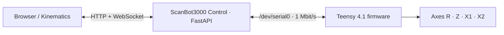

# ScanBot3000 Control

Local Raspberry Pi control bridge and real-time web console for the ScanBot3000 motion firmware.


ScanBot3000 Control runs on the host computer between the browser tools and the Teensy 4.1 motion supervisor. It reads the Teensy console over UART, exposes REST/WebSocket endpoints, serves a lightweight multi-axis dashboard, and forwards operator commands back to the firmware.

> **Project home:** [Scanbot3000](https://github.com/DreamMakers2/Scanbot3000)  
> **Firmware:** [ScanBot3000-firmware](https://github.com/DreamMakers2/ScanBot3000-firmware)  
> **Kinematics UI:** [ScanBot3000-kinematics](https://github.com/DreamMakers2/ScanBot3000-kinematics)

## 🧩 Architecture



The service keeps bounded console/metrics buffers, parses axis telemetry, provides per-axis WebSocket streams, and exposes helpers for homing, stop, coordinated moves, driver status/settings, velocity/acceleration caps, position, and reboot.

## 🚀 Getting started

The established deployment uses a Raspberry Pi 4B with a Linux/systemd environment and the Pi primary UART. The exact Raspberry Pi OS release used during development is not recorded, so no distro-version compatibility claim is made.

```bash
git clone https://github.com/DreamMakers2/ScanBot3000-control.git
cd ScanBot3000-control
python3 -m venv .venv
source .venv/bin/activate
pip install --upgrade pip
pip install -r requirements.txt
cp .env.example .env
uvicorn app.main:app --host 0.0.0.0 --port 8001
```

Open `http://<host>:8001/` from a browser on the same trusted network.

The default serial configuration is `/dev/serial0`, `1,000,000` baud, 8 data bits, no parity, 1 stop bit, LF newline. See [docs/SETUP.md](docs/SETUP.md) before connecting to real hardware.

## Main capabilities

- Four independent R/Z/X1/X2 dashboard panels.
- Per-axis and combined WebSocket console/telemetry streams.
- Persistent label-to-axis routing updated by `setname` commands.
- Position, angle, temperature, limit, and driver telemetry display.
- Global and per-axis stop controls.
- REST helpers for `moveabs`, homing, position, coordinated status, motion caps, driver status/settings, and reboot.
- UART reconnect handling.
- Settings persisted to the ignored local file `config/settings.json`.
- Vendored uPlot frontend assets for lightweight time-series charts.

## API quick reference

| Interface | Purpose |
| --- | --- |
| `GET/POST /api/settings` | Read/update runtime settings. |
| `POST /api/command` | Send a raw Teensy console command. |
| `POST /api/moveabs` | Coordinated X/Z/P/R helper with server-side X/Z/P range validation. |
| `POST /api/stop` | Global or per-axis stop. |
| `POST /api/home` | Send `home z`. |
| `GET/POST /api/pos` | Request/read current position line. |
| `GET/POST /api/coordstatus` | Request/read coordinated-motion status. |
| `POST /api/maxvelocity` | Query/set velocity caps. |
| `POST /api/maxaccel` | Query/set acceleration caps. |
| `GET /api/driverstatus` | Read/refresh physical-axis driver status. |
| `GET/POST /api/driversettings` | Read or toggle physical-axis driver settings. |
| `POST /api/reboot` | Reboot one axis controller. |
| `WS /ws/console` | Combined live stream and command channel. |
| `WS /ws/axis/{axis_id}` | Axis-scoped live stream and command channel. |

See [docs/API.md](docs/API.md) for payloads and examples.

## 🔒 Security model

This service has **no application-layer authentication**. It is designed for a trusted local network and can cause physical motion by forwarding commands to the Teensy. The CORS configuration permits common local/private network origins; that is not an authorization mechanism.

Do not port-forward this service or expose it directly to the public internet. Put authentication, network segmentation, VPN/reverse-proxy policy, and access control in front of it if remote access is required.

Read [SECURITY.md](SECURITY.md) before deployment.

## Documentation

- [Setup](docs/SETUP.md) — Raspberry Pi UART, Python environment, direct run, and optional systemd deployment.
- [Requirements](docs/REQUIREMENTS.md) — verified hardware/software and unknown minimums.
- [Architecture](docs/ARCHITECTURE.md) — data flow and component boundaries.
- [API](docs/API.md) — REST/WebSocket contract.
- [UART console](docs/pi_uart_console.md) — established Pi/Teensy serial workflow.
- [Coordinated motion operations](docs/pi_moveabs_ops.md) — safe `moveabs` workflow.
- [Troubleshooting](docs/TROUBLESHOOTING.md) — issues supported by code/project history.
- [Prompting](docs/PROMPTING.md) — safe AI/agent patterns.
- [Public release checklist](docs/PUBLIC_RELEASE_CHECKLIST.md) — sanitization record.
- [Contributing](CONTRIBUTING.md) and [Security](SECURITY.md).

## Repository layout

```text
.
├── app/                       # FastAPI app, UART manager, parser, state, WebSockets
│   └── static/                # dashboard and vendored uPlot assets
├── config/settings.sample.json
├── docs/
├── scripts/
├── .env.example
└── requirements.txt
```

## License

Licensed under the Apache License 2.0 with the Commons Clause License Condition v1.0. Internal business use, modification, and redistribution are permitted under the license terms; selling the software itself or offering a product or service whose value derives substantially from the software is restricted. See [LICENSE](LICENSE).
