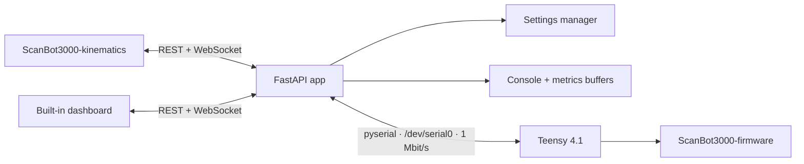

# Control Architecture

## Role

`ScanBot3000-control` is the bridge between browser clients and the Teensy serial console. It owns HTTP/WebSocket transport, settings persistence, telemetry fan-out, and UART reconnect behavior; it does not own embedded motion planning.

## Server components

- `app/main.py` — FastAPI routes, validation, CORS, static UI, application lifecycle.
- `app/uart.py` — serial read/write and reconnect behavior.
- `app/parser.py` — telemetry field extraction.
- `app/state.py` — bounded console and metric buffers.
- `app/settings.py` — validated settings and JSON persistence.
- `app/ws.py` — WebSocket client fan-out.
- `app/static/` — local dashboard and chart assets.

## Data flow

1. Teensy emits newline-delimited console/telemetry lines over UART.
2. The UART manager reads the stream and the app routes lines into buffers and axis-specific WebSocket feeds.
3. Browser clients receive console/metrics updates.
4. REST or WebSocket commands are validated/routed and written back to the Teensy console.

## Trust boundary

The FastAPI layer is intentionally unauthenticated in the current code. CORS is limited to localhost and common private-network ranges, but network authorization must be provided externally.
